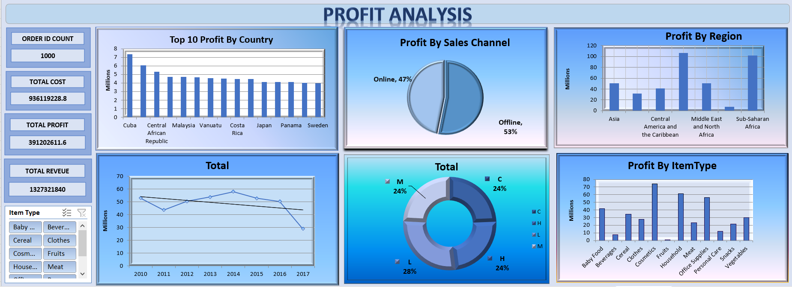
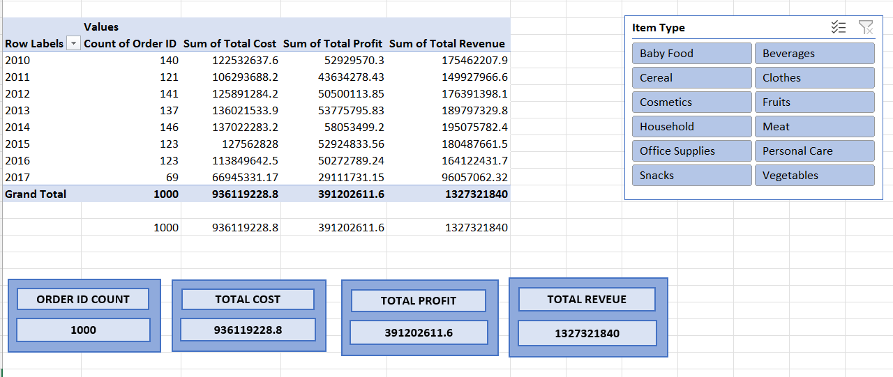
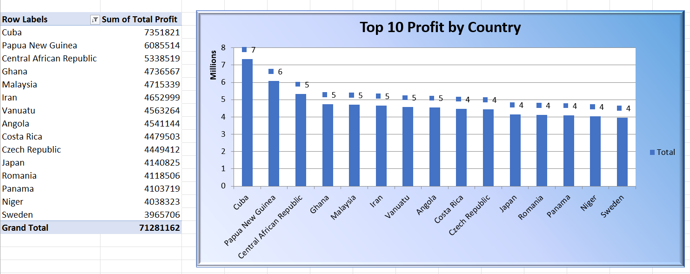
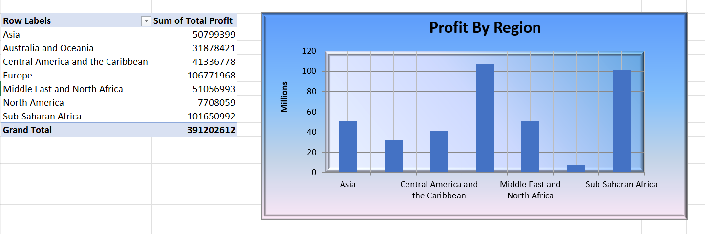
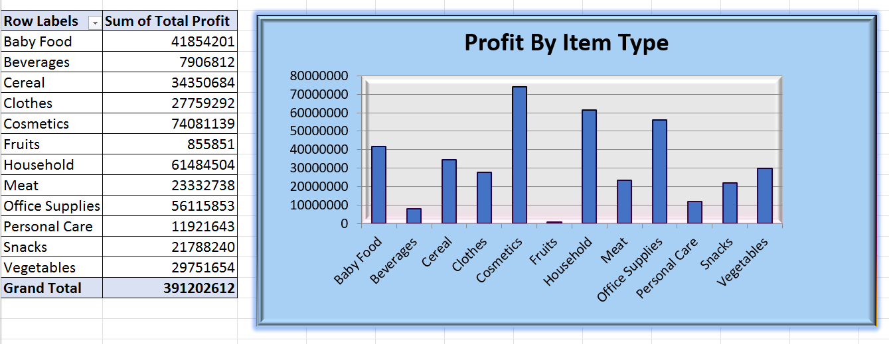
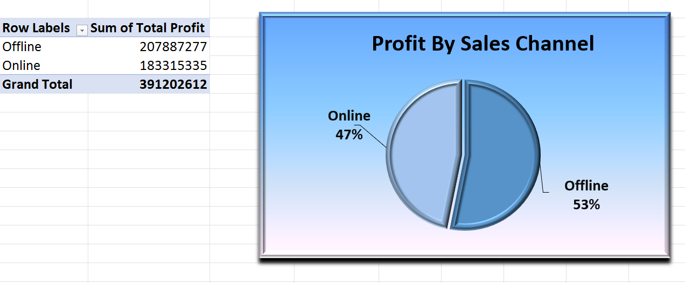
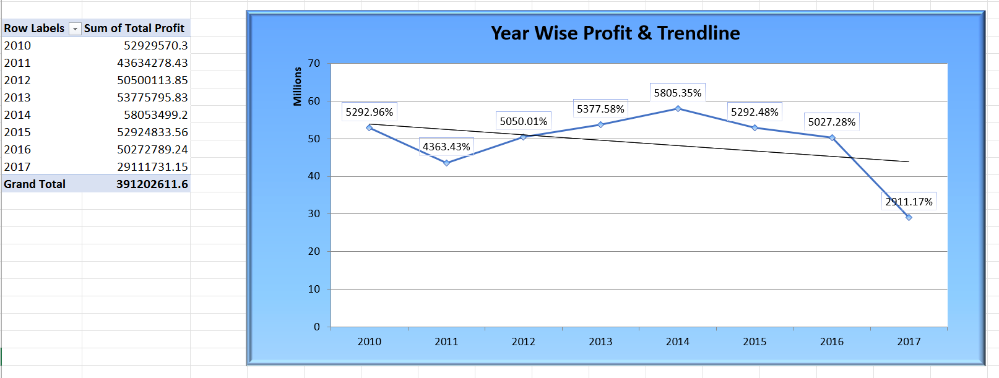
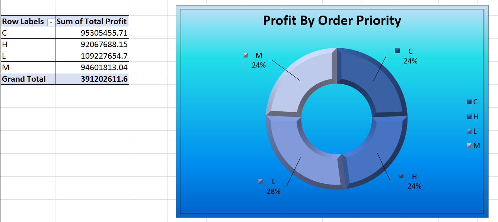

# 📊 Retail Store Profit Analysis Dashboard



## 📋 Table of Contents
- [Project Overview](#-project-overview)
- [Dataset Description](#-dataset-description)
- [Dashboard Features](#-dashboard-features)
- [Key Insights & Findings](#-key-insights--findings)
- [Project Structure](#-project-structure)
- [Tools & Technologies](#-tools--technologies)
- [How to Use](#-how-to-use)
- [Visualizations](#-visualizations)
- [Contact](#-contact)

---

## 🎯 Project Overview

This project presents a comprehensive analysis of global retail sales data spanning from **2010 to 2017**, covering transactions across **multiple countries, regions, and product categories**. The primary objective is to uncover actionable business insights through data visualization and analysis.

**Key Objectives:**
- Analyze sales performance across different geographic regions and countries
- Identify the most profitable product categories and sales channels
- Understand customer order priorities and their impact on business
- Track yearly trends in revenue, costs, and profitability
- Support data-driven decision-making through interactive dashboards

The project features an **interactive Excel dashboard** with dynamic slicers, pivot tables, and charts that enable stakeholders to explore the data and make informed business decisions.

---

## 📂 Dataset Description

The dataset contains **1,000 retail transaction records** from a global retail company operating across multiple continents. Each record represents a unique sales order with comprehensive details about the transaction.

### 📊 Dataset Statistics
- **Total Records:** 1,000 transactions
- **Time Period:** 2010 - 2017
- **Geographic Coverage:** 7 regions, 50+ countries
- **Product Categories:** 12 item types
- **Sales Channels:** Online and Offline

### 📝 Key Data Fields

| Column Name | Description |
|-------------|-------------|
| **Region** | Geographic region (North America, Europe, Asia, etc.) |
| **Country** | Specific country where the order was placed |
| **Item Type** | Product category (Cosmetics, Baby Food, Office Supplies, etc.) |
| **Sales Channel** | Distribution method (Online/Offline) |
| **Order Priority** | Priority level (H-High, M-Medium, L-Low, C-Critical) |
| **Order Date** | Date when the order was placed |
| **Ship Date** | Date when the order was shipped |
| **Units Sold** | Quantity of products sold |
| **Unit Price** | Selling price per unit |
| **Unit Cost** | Production/procurement cost per unit |
| **Total Revenue** | Total income from sales |
| **Total Cost** | Total cost of goods sold |
| **Total Profit** | Net profit (Revenue - Cost) |

*For detailed field descriptions, see [DATA_DICTIONARY.md](DATA_DICTIONARY.md)*

### 🌍 Geographic Coverage
- **North America** (Canada, USA, Greenland)
- **Europe** (Multiple EU countries)
- **Asia** (Japan, Mongolia, Laos, Maldives, etc.)
- **Sub-Saharan Africa** (Multiple countries)
- **Middle East and North Africa** (Libya, Turkey, Israel, etc.)
- **Central America and the Caribbean** (Jamaica, Honduras, etc.)
- **Australia and Oceania** (Fiji, Micronesia)

### 🛍️ Product Categories
Cosmetics • Vegetables • Baby Food • Cereal • Fruits • Clothes • Household • Office Supplies • Snacks • Beverages • Meat • Personal Care

---

## 📊 Dashboard Features

The Excel dashboard provides a comprehensive view of business performance through multiple interactive components:

### 🎯 Key Performance Indicators (KPIs)
- **Total Orders** - Complete count of transactions processed
- **Total Revenue** - Aggregate income generated from all sales
- **Total Cost** - Cumulative cost of goods sold
- **Total Profit** - Net profit across all transactions

### 📈 Interactive Visualizations

1. **Top 10 Countries by Profit** - Identifies the most profitable markets globally
2. **Profit by Region** - Shows profit distribution across geographic regions
3. **Profit by Item Type** - Displays profitability of different product categories
4. **Profit by Sales Channel** - Compares Online vs Offline sales performance
5. **Yearly Profit Trend** - Tracks profit evolution over time (2010-2017)
6. **Order Priority Distribution** - Analyzes the distribution of order priorities

### 🎛️ Interactive Filters
- **Item Type Slicer** - Filter all visualizations by specific product categories
- Dynamic updates across all charts for real-time analysis

---

## 💡 Key Insights & Findings

Based on comprehensive analysis of 1,000 transactions spanning 2010-2017:

### 🏆 Geographic Performance
- **Sub-Saharan Africa** shows significant presence in the dataset
- **Top performing countries** include Libya, Canada, Japan, and various European nations
- Multiple emerging markets demonstrate strong growth potential

### 📦 Product Performance
- **High-value items** include Household goods (Unit Price: $668.27) and Office Supplies (Unit Price: $651.21)
- **Fast-moving products** include Fruits and Beverages (lower unit prices, higher volume)
- **Profit margins** vary significantly across product categories

### 🌐 Sales Channel Insights
- Both **Online and Offline channels** are actively utilized
- Channel preference varies by region and product type
- Multi-channel strategy is essential for market coverage

### 📅 Temporal Trends
- Business operations span **7+ years** with consistent activity
- Year-over-year patterns indicate business stability
- Growth opportunities identified through trend analysis

---

## 📁 Project Structure

```
Retail_Store_Profit_Analysis/
│
├── 📄 README.md                          # Project documentation
├── 📄 DATA_DICTIONARY.md                 # Detailed field descriptions
├── 📄 LICENSE                            # MIT License
├── 📄 .gitignore                         # Git ignore rules
│
├── 📂 data/
│   └── retail-store-sales-data.csv       # Raw dataset (1,000 transactions)
│
├── 📂 dashboard/
│   └── retail-store-dashboard.png        # Complete dashboard screenshot
│
├── 📂 visualizations/
│   ├── kpi-cards-and-slicers.png         # KPI metrics and filters
│   ├── profit-by-item-type.png           # Product category performance
│   ├── profit-by-region.png              # Regional profit distribution
│   ├── profit-by-sales-channel.png       # Online vs Offline comparison
│   ├── top-10-profit-by-country.png      # Top performing countries
│   ├── yearly-profit-trend.png           # Time series analysis
│   └── order-priority-distribution.png   # Priority level breakdown
│
└── 📂 workbook/
    └── retail-store-analysis.xlsx        # Excel file with analysis
```

---

## 🛠️ Tools & Technologies

### Microsoft Excel
- **Pivot Tables** for data aggregation and summarization
- **Pivot Charts** for dynamic visualizations
- **Slicers** for interactive filtering
- **Conditional Formatting** for data highlighting
- **Formulas and Functions** (SUM, AVERAGE, IF, etc.)

### Data Analysis Techniques
- ✅ Data Cleaning and Preparation
- ✅ Statistical Analysis
- ✅ Time Series Analysis
- ✅ Comparative Analysis
- ✅ KPI Development

### Visualization Types
- 📊 Bar Charts (Horizontal & Vertical)
- 🥧 Pie Charts & Donut Charts
- 📈 Line Charts for Trends
- 📋 KPI Cards
- 🎛️ Interactive Slicers

---

## 🖼️ Visualizations

### Complete Dashboard


### KPI Cards and Slicers


### Top 10 Countries by Profit


### Profit Distribution by Region


### Product Category Performance


### Sales Channel Analysis


### Yearly Profit Trend


### Order Priority Distribution


---

## 📈 Future Enhancements

Potential improvements for this project:

- [ ] Add predictive analytics for future sales forecasting
- [ ] Implement customer segmentation analysis
- [ ] Create automated reports using VBA macros
- [ ] Integrate with Power BI for advanced visualizations
- [ ] Add shipping time analysis (Order Date vs Ship Date)
- [ ] Perform ABC analysis for inventory management
- [ ] Include profit margin % calculations by category
- [ ] Add geographic mapping visualizations

---

## 📧 Contact

**Divya Thakur**
- GitHub: [@divyathakur15](https://github.com/divyathakur15)
- LinkedIn: [Connect with me](https://www.linkedin.com/in/divyathakur15)

---

## 📄 License

This project is licensed under the MIT License - see the [LICENSE](LICENSE) file for details.

---

## 🙏 Acknowledgments

- Microsoft Excel community for tips and best practices
- Open source community for continuous learning
- Data analysis best practices from the analytics community

---

## ⭐ Show Your Support

If you found this project helpful, please consider giving it a star! It helps others discover the project.

---

**📊 Happy Analyzing! 📊**

*Last Updated: March 2026*
